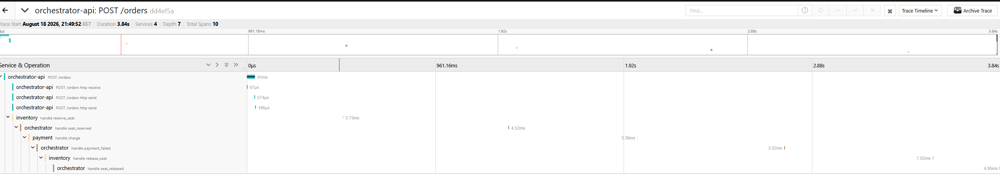

# Saga Orchestrator v2 — Outbox + Debezium + Kafka

Same order saga as v1, rebuilt on the **transactional outbox** pattern: services
never publish to the broker directly. They write an event into a local `outbox`
table in the same transaction as the business change, and **Debezium** tails the
Postgres WAL and ships those rows to **Kafka**. Services consume from Kafka.
Distributed tracing (OpenTelemetry → Jaeger) follows each order across everything.

**Stack:** Python, FastAPI, PostgreSQL, Kafka (KRaft), Debezium, OpenTelemetry + Jaeger, Docker.

## Flow

```
POST /orders
  └ orchestrator: write order+saga + outbox row   (ONE tx)
        │ Debezium tails WAL
        ▼
     Kafka topic  inventory.commands
        │ inventory consumes
        ▼
  inventory: dedup(inbox) + reserve seat + outbox reply   (ONE tx)
        │ Debezium -> Kafka  orchestrator.replies
        ▼
  orchestrator.advance: ... -> payment.commands -> ... -> CONFIRMED
```

## Structure

```
docker-compose.yml     kafka + postgres(logical) + debezium connect + jaeger + services
sql/init.sql           3 DBs: business tables + outbox + inbox
connectors/*.json      Debezium connector per DB (Outbox Event Router SMT)
scripts/register-connectors.sh
shared/outbox.py       write_event(): append to outbox in the caller's tx
shared/kafka.py        consume(): read topic, commit offset after handler
shared/tracing.py      OpenTelemetry -> Jaeger
services/orchestrator/ saga.py (state machine), api.py, consumer.py
services/inventory/     main.py
services/payment/       main.py
```

## Run 

```bash
docker compose up -d --build
bash scripts/register-connectors.sh     
curl -X POST localhost:8000/orders -H "Content-Type: application/json" \
  -d '{"seat_id":1,"amount":100}'
```

- Kafka Connect REST: http://localhost:8083/connectors
- Jaeger UI: http://localhost:16686

## Tracing

Each order is one trace in Jaeger — and it now spans the whole outbox → Debezium →
Kafka path, not just a direct broker hop. A normal order runs straight through;
a failed one visibly rolls back.



*Happy path — reserve → charge → confirm.*
